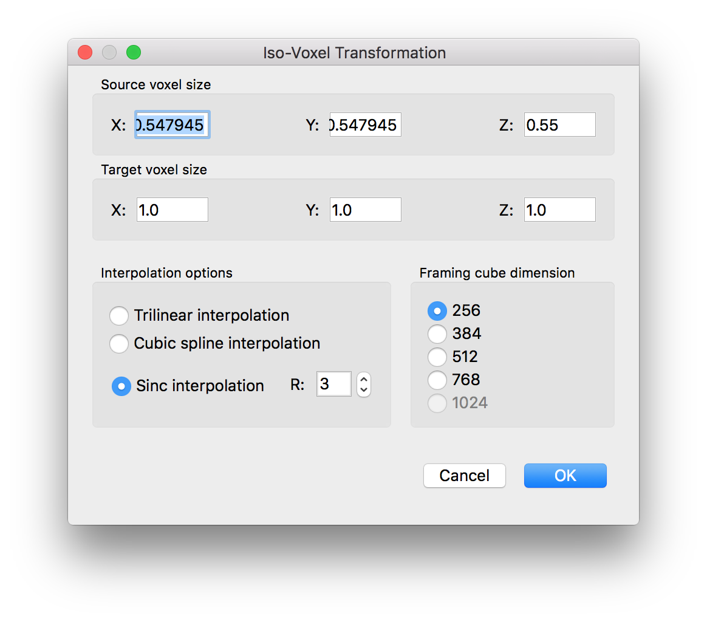
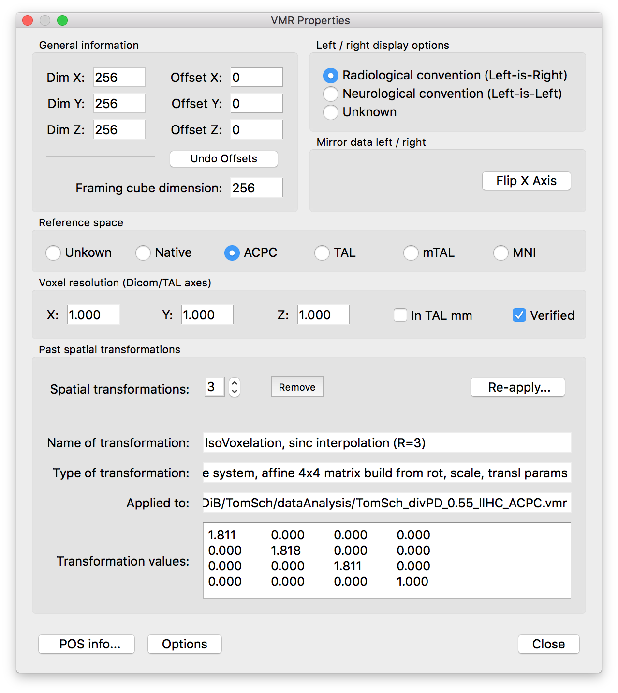
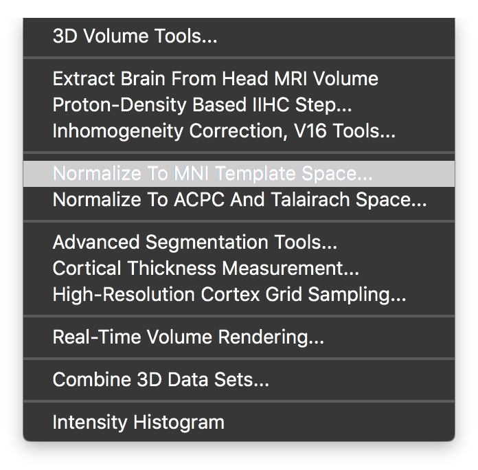
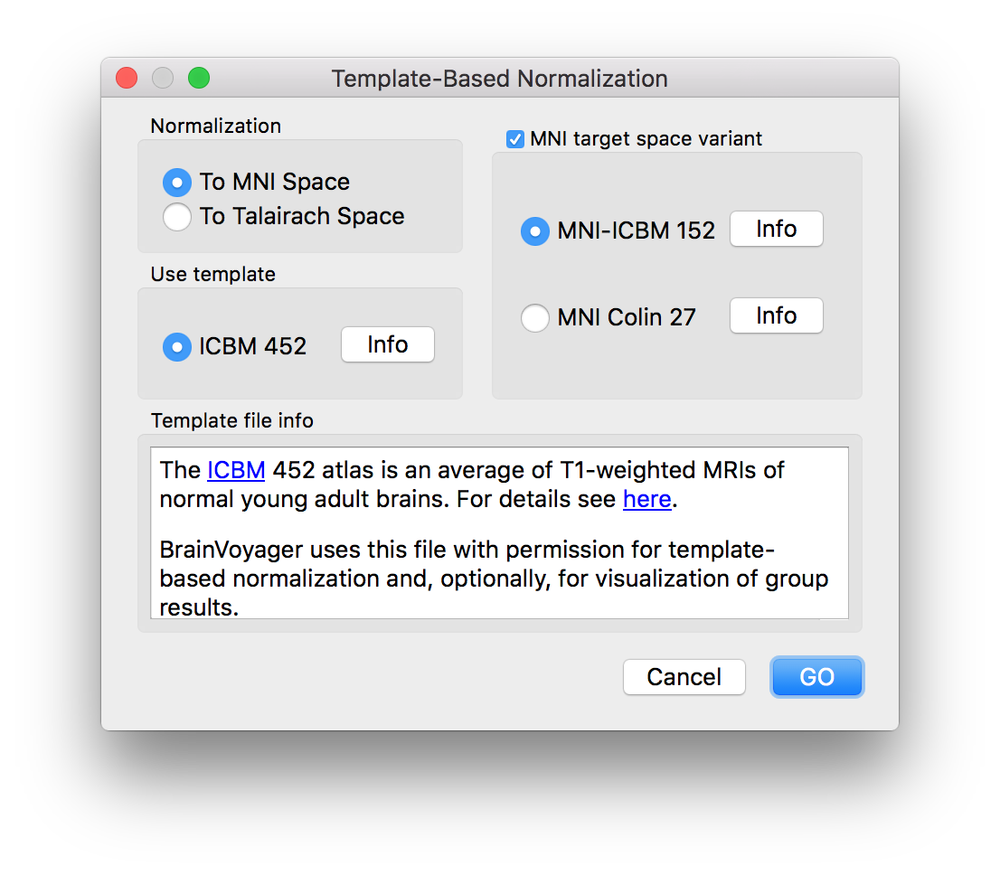
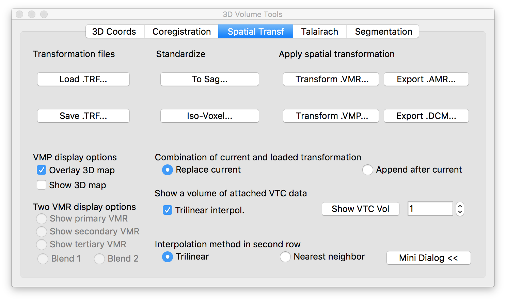
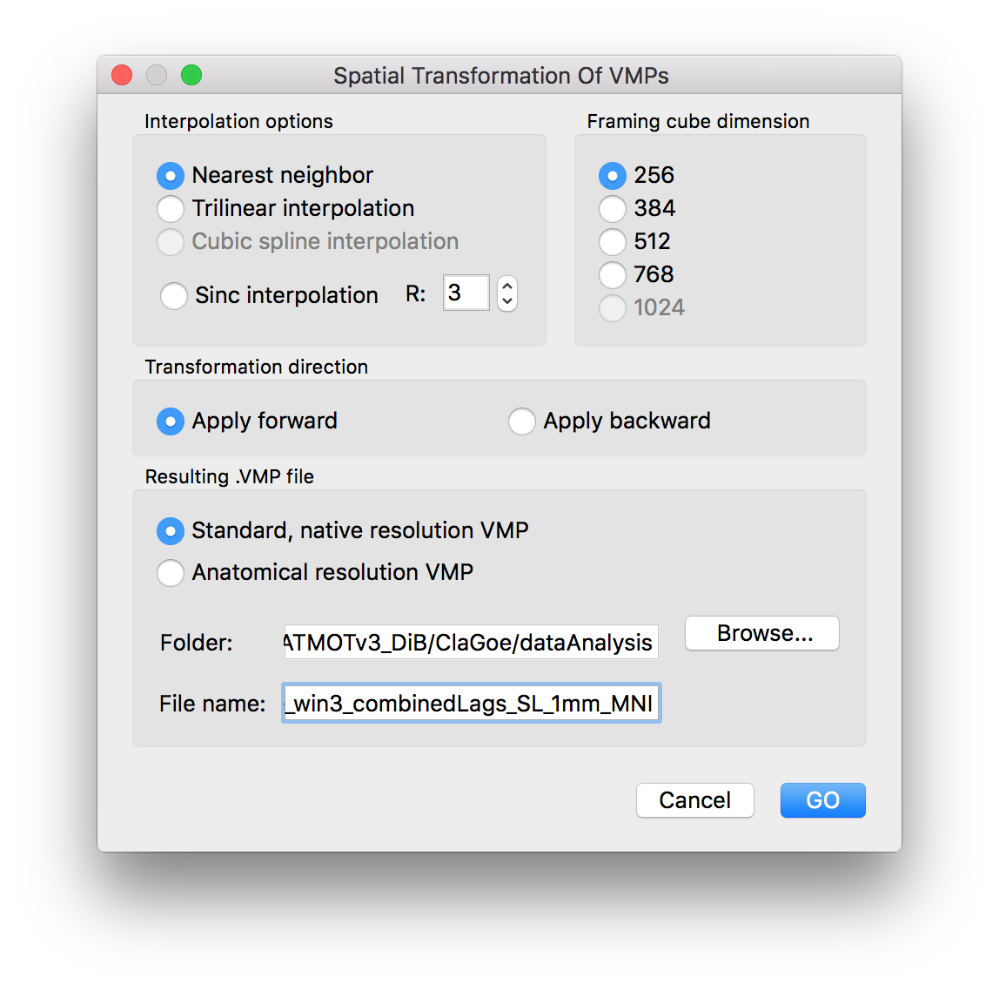

# From Brainvoyager 20 to neurovault.org
This howto/example/script explains how to convert VMP maps that are in (_e.g._) Brainvoyager Talairach Space to NIftI files in MNI format that can be uploaded to www.neurovault.org
__Please note:__ This is not a plug-and-play solution. You will need to adapt the Matlab scripts to you own needs. I do not take any responsibility for the correctness of the output data!

In my case I started out with VMP files with a relative resolution of 2 and VMR files with a resolution half of the functional data (and, hence, the map resolution). I wanted to output 1x1x1mm iso-voxel maps to upload to NeuroVault.

## Prerequisites
- Matlab
- NeuroElf (www.neuroelf.net)
- Brainvoyager 20 or higher
- FSL5.0 or higher

## Step 1 - normalization of VMR to 1mm iso-voxels

- Transform the VMR to a resolution of 1x1x1mm and a framing cube of 256. Use sinc interpolation.

- Save the VMR as \_1mm.vmr.

- Check the VMR properties of the newly created VMR and copy the transformation matrix that is shown at the bottom to a 'fake' .trf file. Save the file as "1p1mm_TO_1mm.trf". Note: You only need to do this once if all your subjects were recorded with the same scanning parameters.

## Step 2 - MNI transformation of VMR

- With the resulting 1mm VMR open go to the MNI transformation dialog

- Keep the standard settings and click GO

## Step 3 - creating a native resolution VMP

- run the script "highresVMP.m" to create VMPs with a resolution of 1.1x1.1x1.1mm and a framing cube of 256. These files are saved with the suffix '\_1p1mm.vmp'.

## Step 4 - creating a 1x1x1mm VMP

- Open the 1mm VMR from step 1 and load the new native resolution VMP from step 3. It will not fit the anatomy but that is OK.

- Load the trf file 1p1mm_TO_1mm.trf

- Click on 'Transform VMP...'

- Choose Nearest Neighbor interpolation and give the new filename the suffix '\_1mm'.

- You can check the coregistration of the resulting VMP maps if you want.

## Step 5 - creating an MNI space VMP

- Open the 1mm VMR from step 1 and load the new 1x1x1mm resolution VMP from step 4. It should coregister well to the VMR.

- Load the trf file that was created in step 2 called "\_1mm_TO_MNI_a12.trf"

- Click on 'Transform VMP...'

- Choose Nearest Neighbor interpolation and give the new filename the suffix '\_1mm_MNI'.

- You can check the coregistration of the resulting VMP maps if you want.

## Step 6 - run the Matlab script

- Run the Matlab script "mnivmp_to_nii.m". It will take care of the rest and provide you with .nii.gz files in the results folder.
